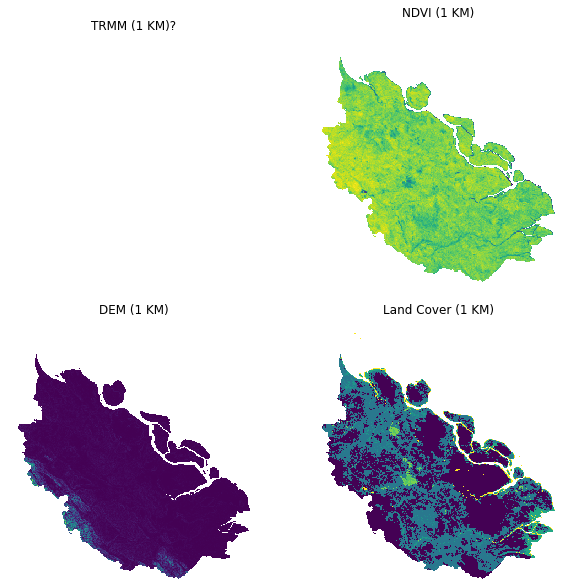

# Machine Learning-Based Spatial Downscaling For Visualizing High-Resolution Precipitation Map From TRMM Satellite
## Case Study: Riau Province, Indonesia
 
In this project, I implement machine learning model to visualize precipitation map on high-resolusion version from TRMM Satellite. The satellite has 25x25 KM per pixel resolution, which is not hightly detailed to know precipitation in certain location. Variables like NDVI, DEM, and Land Cover will be used as predictor to Precipitation value by using machine learning model, in this case Random Forest.  
