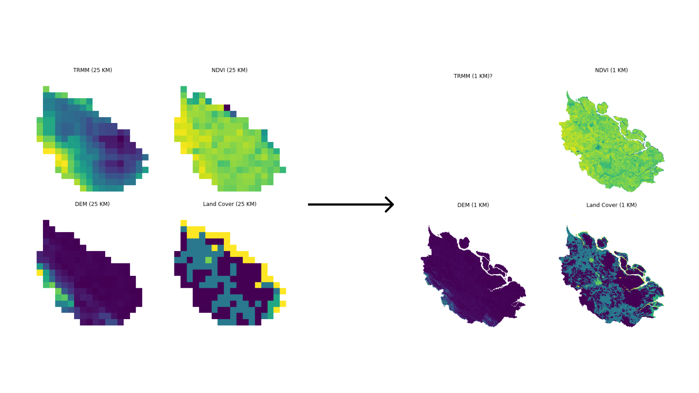
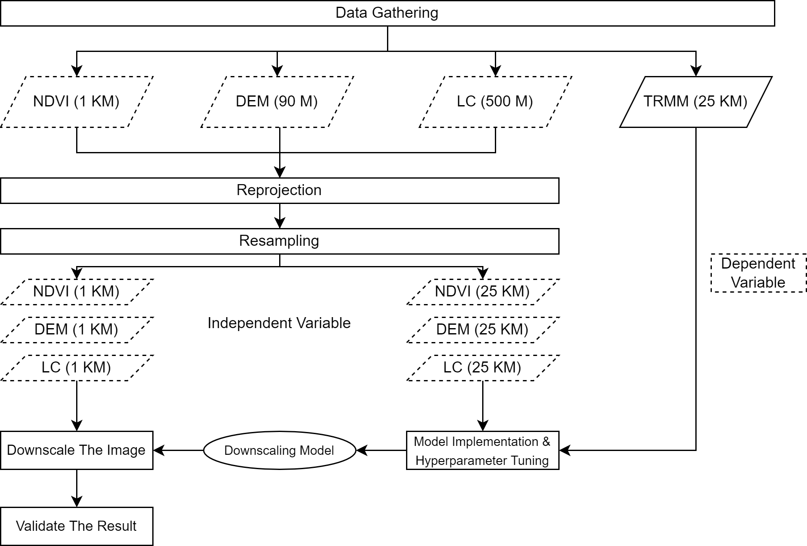
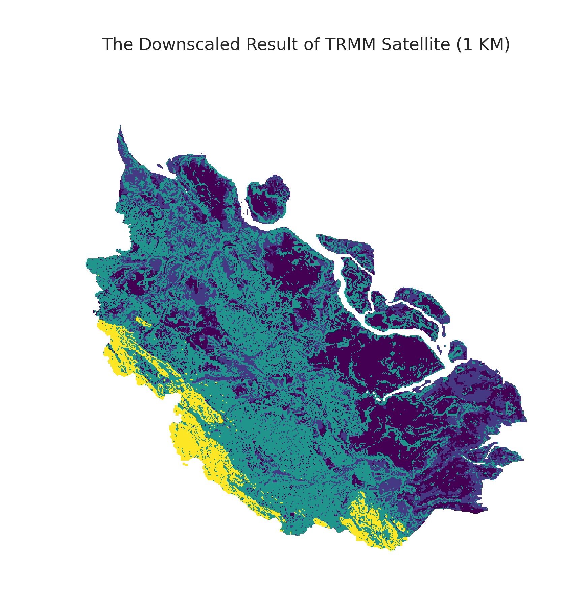

# Machine Learning-Based Spatial Downscaling For Visualizing High-Resolution Precipitation Map From TRMM Satellite
## Case Study: Riau Province, Indonesia
 

### Introduction
In this project, I implement machine learning model to visualize precipitation map on high-resolusion version from TRMM Satellite. The satellite has 25 km per pixel resolution, which is not hightly detailed to know precipitation in certain location. Variables like NDVI, DEM, and Land Cover will be used as predictor to Precipitation value by using a machine learning algorithm. The final output of this project is a precipitation map on Riau Province with a spatial resolution of 1 km.

### The Workflow
 
I implemented the project using Python along with libraries like scikit-learn to model the data, pandas for processing the dataset, GDAL and gee library to retrieve and preprocess the data. In general, the step starts with gathering the data from the Google Earth Engine platform. Then, I filtered the study area using a boundary data from GADM and retrieved data from 2018. Next, I resampled the data into 25 km resolution for the model training and 1 km resolution for generating the high resolution precipitation data. With those data, I trained the model using decision tree, random forest, multiple linear regression, and support vector machine and chose the best model between them. Finally, I used the best model to generate the high resolution precipitation data.

### The Result
From the research process, I found the decision tree has the best result. Therefore, I used the model for generating the high-resolution precipitation data. The below figure shows the final result of the downscaling process.
 